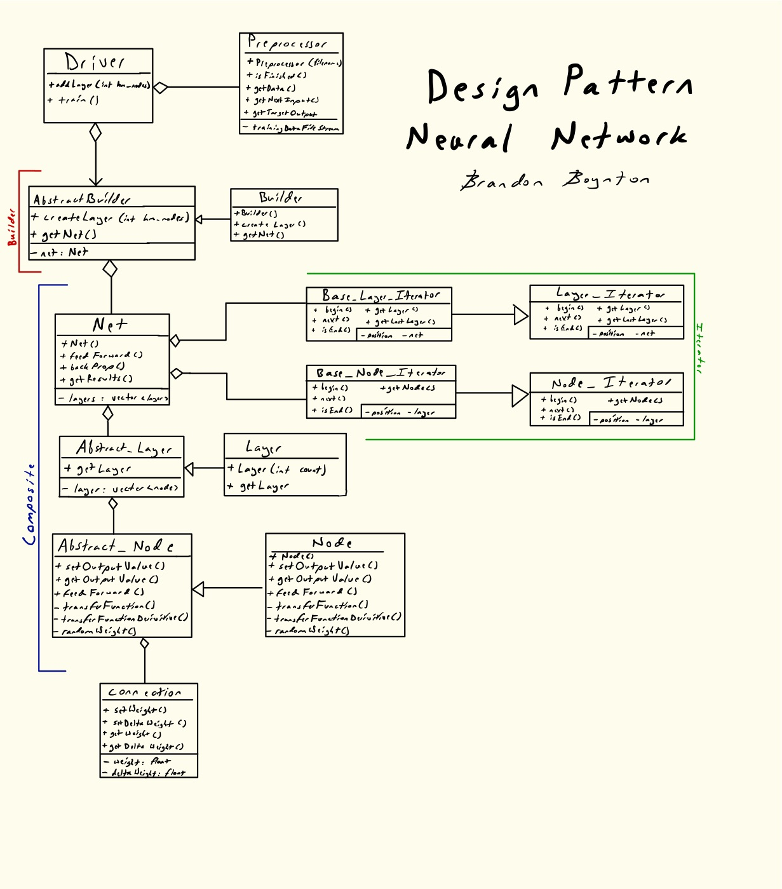

# Design Pattern Deep Neural Network

## Goal
The goal of this project is to build a system that allows the user to design a neural network to apply to a standard dataset. The neural network will be built using as many applicable design patterns as possible.

## Data

Two datasets are available with the neural network for varied complexity.

### XOR
The first is an Exclusive OR (XOR) dataset. The user should construct the neural network with 2 nodes in the first layer and 1 in the last. When inferencing, each node can either be 1 or 0, ideally producing a value close to the intended XOR result.

### Breast Cancer

This is a popular neural network testing dataset. The dataset is a series of numbers, comma separated, corresponding to the columns defined below.
`clump_thickness,unif_cell_size,unif_cell_shape,marg_adhesion,single_epith_cell_size,bare_nuclei,bland_chrom,norm_nucleoli,mitosis,class`

In this dataset, the `class` value is either 0 or 1. If the patient was diagnosed with breast cancer, a 1 is assigned. Otherwise a 0 is assigned. The goal of this neural network is to correctly predict the patient's class based on the other data related to a tested tumor.

The user should construct the neural network with 9 input nodes and 1 output node. Each input value can be between 1 and 10.

## Design
This neural network is atypical, in that it is built to work with a number of design patterns. More specifically, when building the neural network, an **Abstract Builder** pattern is used. The network also features an abnormally high usage of Object Oriented programming. This allows each component of the neural network to be it's own object. When interconnected and functioning, this implements the **Composite Pattern**.

# Essay

This project was done for an IUPUI Design Pattern's class, and the following is the corresponding essay.

## Background

Coming into this project, I have had a lot of experience building, fine-tuning and implementing neural networks. All of my previous experience, however, involved the use of a preexisting framework or library such as TensorFlow or Theano. I was very familiar with the theory and mathematics behind the frameworks, but had never build a neural network from scratch. I was excited for the challenge.

As an additional challenge, before this class, I had never been exposed to design patterns. Without any outside-of-class experience, I was to build a neural network using as many design patterns as possible.

## Goals

**Primary Goal**:
Build a functioning neural network using object oriented programming with as many applicable design patterns as possible.

**Secondary Goal**: Use a breast cancer diagnosis dataset to train the neural net to diagnose breast cancer at a reasonable accuracy. (Practical application of this project)

## Planning

Because this project relies so heavily on design patterns, it required a lot of white boarding and pre-planning. I spent quite a bit of time taking every component of a neural network, breaking it up into classes, thinking of the necessary functions, and designing the structure of just the neural network.

At that point, I started to look for places where design patterns could be used.

**Composite Pattern**

This was the most obvious. Because the neural network was being broken up into classes, it made the most sense to connect it in a composite. Each *net* has *layers*. Every layer is composed of *nodes* and every node owns a set of *connections* that correspond to every node in the last layer.

Altogether, you end up with a setup like this:

**Builder Pattern**

From there, what's the best way to build a composite? Through a *builder* obviously. I set up the builder to work in a very straightforward way. The client creates a builder object, then generates the shape of the neural network by calling `.addLayer(int hm_nodes)`. That function then calls the builder's other functions, such as `.addNodes()`. This eventually creates a full neural network.

In my client, I ask the user to provide the topography of the neural network by inputting a string such as `9,4,1`. This would use the builder pattern to create a neural network with 3 layers. One input layer with 9 nodes, a hidden layer with 4 nodes, and a single node on the output layer.

**Iterator Pattern**

Throughout the execution of training and inferencing, there are a number of places where looping is essential. Rather than trying to get a variable to loop to, the iterator pattern has proven to work better. The iterator has a constructor function that takes in the layer or node that it is iterating through. It then collects the proper information and iterates through the appropriate variable for that object. This pattern is primarily used in the feed forward process.

## Running the program

When running the program, you will be prompted to choose your dataset. The program will ask you to choose your dataset (defined above). Because each dataset is different and requires different preprocessing, there is a Base_Preprocessor and then a separate Preprocessor for each dataset.

Once you choose the dataset to use, you'll be asked to design the shape of the neural network. This is done as is explained before. As the program tells you, the number of input nodes should be equal to the number of input nodes should be equal to the number of inputs that the dataset provides. The number of output nodes should always be 1 because the program only constructs binary classifiers.

From there, you choose how many epochs to train for. An epoch is an entire run through the dataset. Too many epochs can lead to overfitting (which is bad and produces inaccurate results). Too many epochs can lead to underfitting (which is bad and produces inaccurate results).

After you hit enter, the model will train. Some insights into last accuracy and the average accuracy will be displayed every 100 rows trained.

Finally, the NN will stop training. At this point, the user can inference. This is when you give the neural network new data and see what the output is.

When finished inferencing, type `QUIT`.

## Known problems

Fortunately, by and large the program works well. The known errors consists mostly of NN training bugs. This is largely due to the activation function and loss function used in the backpropegation process.

For the activation function, a `tanh` function is used. This is a fairly old and outdated. It was chosen because it is the most straightforward activation function and can easily be implemented with all the design patterns chosen. Ideally, a larger-scale neural network would use a `RELU` or `leaky RELU` activation function on the hidden layers and a `softmax` function on the final layer. However, this was far outside the scope of the project.

The same principle applies to the loss function, but less so. This NN uses an `Root Mean Squared` loss function. This is sufficient for the datasets used, but wouldn't be ideal for more complicated datasets.

Finally, there are some exploding/vanishing gradient issues on both datasets. The XOR dataset provides the best accuracies, but because of the randomly initialized beginning connection weights, the gradients can still sometimes "explode" or "vanish". This can be seen when every inference does not return a value (exploding) or when every inference returns either 1 or 0 (vanishing). In this case, simply quit the program and restart to get better results.

## Challenges

Throughout the development process, there were certainly a number of problems that stumped me. Fortunately, with enough thinking, problem solving and the occasional Stack Overflow, the primary goal has been satisfied.

## Results

The final neural network has proven to perform relatively effectively. It is by no means groundbreaking, but for a neural network written from scratch, focusing on design patterns over accuracy, it performs well. Not only did I learn a decent bit on how to program a neural network, but I also gained knowledge on how to implement design patterns in a real-world, practical application.
