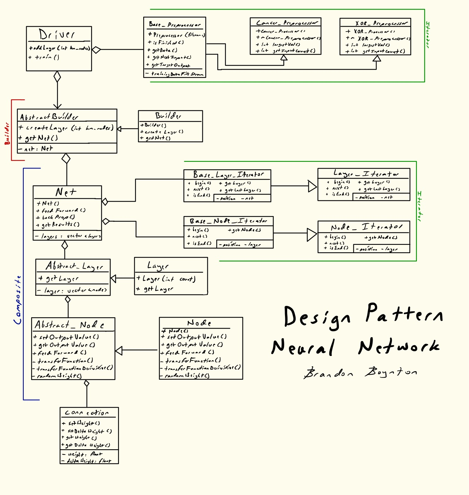

# Design Pattern Deep Neural Network

## Goal
The goal of this project is to build a system that allows the user to design a neural network to apply to a standard dataset. The neural network will be built using as many applicable design patterns as possible.

## Data

Two datasets are available with the neural network for varied complexity.

### XOR
The first is an Exclusive OR (XOR) dataset. The user should construct the neural network with 2 nodes in the first layer and 1 in the last. When inferencing, each node can either be 1 or 0, ideally producing a value close to the intended XOR result.

### Breast Cancer

This is a popular neural network testing dataset. The dataset is a series of numbers, comma separated, corresponding to the columns defined below.
`clump_thickness,unif_cell_size,unif_cell_shape,marg_adhesion,single_epith_cell_size,bare_nuclei,bland_chrom,norm_nucleoli,mitosis,class`

In this dataset, the `class` value is either 0 or 1. If the patient was diagnosed with breast cancer, a 1 is assigned. Otherwise a 0 is assigned. The goal of this neural network is to correctly predict the patient's class based on the other data related to a tested tumor.

The user should construct the neural network with 9 input nodes and 1 output node. Each input value can be between 1 and 10.

## Design
This neural network is atypical, in that it is built to work with a number of design patterns. More specifically, when building the neural network, an **Abstract Builder** pattern is used. The network also features an abnormally high usage of Object Oriented programming. This allows each component of the neural network to be it's own object. When interconnected and functioning, this implements the **Composite Pattern**.

